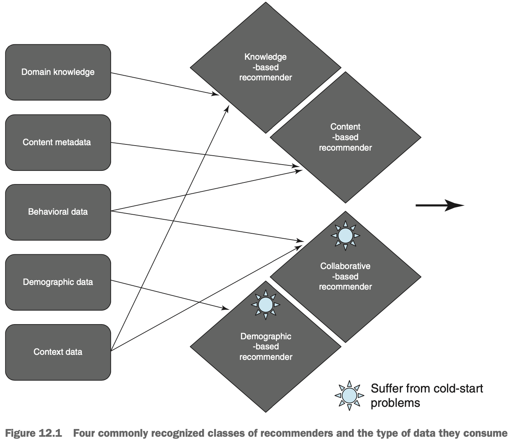
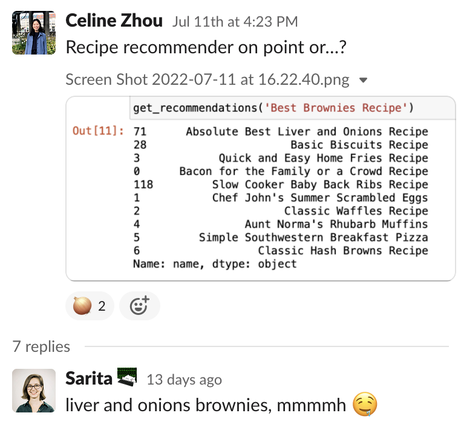
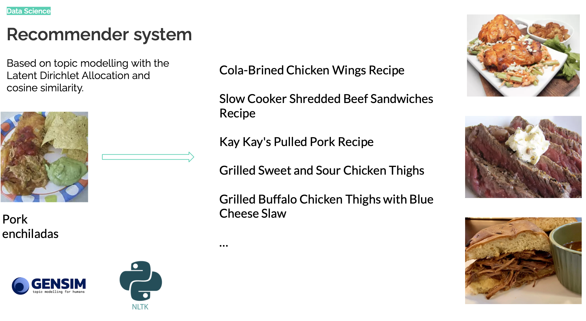

# Ingreduce: our experience

Hello! We are a team of 6, all learners of tech skills (Data Science, UX Design, Web Development) at Techlabs. We've been building our web app, *Ingreduce*, for around 2 months, and here is our account of our experience building it.

## UX Design

UX biggest challenge was the limited amount of time available for the whole project that wouldn’t allow us to have a solid User Research and Wireframes before the Web Development team would start working. So we had to rush the User Research while we started working on the Wireframes already.  For the User Research we use a Google survey that would allow us to share it with a wider range of people in a short amount of time.

We could see that the vast majority of the interviewees chose to cook at home because it is cheaper and healthier. Even though cooking with the ingredients you already have didn’t seem to be a strong factor of choice, we still believe people would prefer that over shopping for ingredients. Also we felt encouraged by the percentage of people that use websites to look for recipes online. 

While creating our Personas, User Stories and Scenarios, we realized our ingredient tracking website could be used by a wide range of people, from students who want to save money, to professionals that are environmentally aware to parents who want to cook healthy and have to be efficient with their time and have limited amount of time to go shopping. 

Cheap and healthy were important factors for the people we surveyed. However, we also know that cooking with ingredients you already have would help combat food waste, which is an increasing problem in both developed and developing economies. So we chose “environmentally concious” as a main value for our website which we would want to transmit to our users to differentiate our website further. So for the design, we decided to go for a simple and clean website with green as the main color in the palette to reflect on its environmental values as well as the health benefits. We would also use a more environmental messaging, starting on the Homepage.

Deciding on the actual features of the website was difficult. As a team we wanted some advanced features such as filters per kind of cuisine but we knew we had to trim them to decide on a MVP for this project. So we decided we needed the user to be registered to record their ingredients for the next time they need a recipe. We also decided on having a Dashboard or Ingredient Page as the first landing page once logged in so the user could add ingredients to their inventory before looking for a recipe. Then the user would be offered a list of recipes that include the ingredients they currently have. We also decided on adding a Congratulatory Message that would display once the user marked the recipe as Done to encourage them to keep using our website thus combating food waste. 

Creating the Wireframes was a continuous feedback loop between Alpy and Elsy as well as the Web Developers, so many changes were made along the way. From there, moving  to the Prototype helped us picture what the website could actually look like, even before the WD were ready with the MVP. It helped us confirm the user flow we had selected and give us an idea of how intuitive the website could be.

Finally we were ready to test our prototype and we chose three people with different backgrounds for the testing. We sent them the link for the prototype in Figma for testing. Although we had to explain it wasn’t the actual website,  they all in all agreed the prototype was pretty clear and intuitive. 

## Web development

### Front-end development

At the beginning of the project phase we talked about the different stacks that we would use. As originally, we were thinking of creating a mobile app, we were considering using React Native but in the end we decided against that and wanted to rather use the tools that we already learned during the learning phase at TechLabs to deepen our knowledge there.

Besides using *HTML*, *CSS* and *JavaScript*, we were utilizing the CSS framework *Bulma* and *ReactJS* as javascript library.

After ideating our MVP and boiling down which components we would definitely need, our two frontend developers each chose a component of their liking to start with and went to work!

As time was limited, we needed to start coding before UX could deliver the wireframe, but we communicated with our UX designers and track leads before deciding it is ok for the UX and frontend-design to differ a bit so that nobody had to change their design.

Especially *ReactJS* and *Bulma* took some getting used to and we had to learn quickly that some functionalities take more time than we initially thought it would take, so we had to do some expectation management and focus on the components that really matter. That experience was a valuable lesson though and we can more easily estimate the time scope of tasks.

After the recipe database was ready, we prepared our files for the backend developer to do his magic.

### Back-end development

Working on the backend for Ingreduce was quite the journey. For backend specifically I had previously learned to use Node.js, Express.js and MongoDB on a very basic level. Once the project phase was kicked off and we started working on our own website, I implemented some server functionalities - meaning, I started my own local server and wrote a first little demo API, to connect our frontend and backend. 

Over these first few weeks our mentor introduced me to Firebase, which I worried might make my work all too easy -  after all, as a Backend-as-a-Service development platform, it comes prepackaged with many of the solutions that I had expected to create from scratch. I couldn't have been more wrong: I tried to stick to the traditional client and server folder structure and ended up creating a Frankenstein's Monster kind of Firebase-meets-traditional-backend curiosity. After many trial runs and lots of research (and electing to not go for the more common seeming setup of Firebase within the client folder) I decided that the best course of action was to ditch Firebase and instead go back to using Node.js, Express.js and MongoDB.

Intital Firebase successes:

I want to use this opportunity to thank the TechLabs track leads Basan and Zubin, in particular. Basan helped me come to this difficult (and late) decision, and both of them provided me with invaluable insights that pushed me ahead as I had to (re)write my entire backend within the last two-and-a-half weeks of the project. The required backend to achieve the Ingreduce MVP was not too complicated, thankfully, so I was able to create the necessary functionalities within this cramped time frame. Of course, there were many roadblocks along the way (sessions were especially uncooperative, in the beginning), but I'm happy with the final result. It was gratifying to connect my backend logic and database setup with the frontend through my APIs, and I even learned a thing or two about React along the way. At the end, I even had some spare time left to add some extra functionalities (such as a personalized welcome message depending on login status) and refine some of the frontend styling alongside my fellow web developers.

Activity of our MongoDBAtlas database:

Besides our backlog, one thing I feel regretful about is that I didn't manage to fully deploy our website - some of its functionalities are deployed via Heroku, however the swap from local to remote has once again sparked the rebellious and unyielding spirit of Express sessions, rendering the website overall unusable in its deployed state. 

## Data Science

The Data Science team (that consists of me, Celine 👋) had three main products to deliver for this project:
- some Datasets,
- a Machine Learning model,
- and a Data Visualization project.

Let's start with the process behind the development of the datasets.

### Datasets

We're making a web app that helps users track their ingredients at home and suggests recipes based on the ingredients available. This means that we need a dataset of ingredients (preferably with their food category) and a dataset of recipes and its meta data.

We'll first go over the latter.

#### Recipe dataset

##### Selecting the source

The recipe data were collected from the website allrecipes.com. This source was chosen because:
- It is popular. [(See source.)](https://www.similarweb.com/top-websites/category/food-and-drink/cooking-and-recipes/). So, I *assumed* that the website and its recipes are well-liked.
- It includes international cuisines. Our target market is multicultural, so it is important to satisfy the specific palates from the different cultures (as mentioned [here](https://hdsr.mitpress.mit.edu/pub/wjrl1qsq/release/3)).
- Each recipe on the website has undergone a series of reviews so that there are no duplicate recipes, each recipe is complete and replicable (or, so they say [here](https://www.allrecipes.com/about-allrecipes/#d606bc500019a1df9c9d5fbf00cacac6)). As a consequence for DS, the data is 'usable'.
- It features useful information for all recipes, such as prep and cooking times, pictures, nutrition facts, etc.

##### Collecting the data

Once the source was chosen, the data compilation can start. It had two steps. First, I collected the urls of recipes from allrecipes.com. Then, I collected each recipe's information from the urls collected.

At first, only a sample of 427 recipes were collected from the website as the need for a bigger dataset was not clear at the time. Then, as I started working on the machine learning algorithm, I saw that a bigger dataset would help me get better results (See Machine Learning algorithm section). As the first sample consisted of featured recipes, my scraping code was tailored to this dataset with little missing data. But as I moved to trying to scrape the entire recipe dataset available, I saw that my initial code was lacking. Some recipes go back to as far as 20 years!! Thus, the data entered back then were not as detailed as the ones that are entered today. This means that some information that are present in today's recipes, like 'prep time', are not present in some other recipes. I made the mistake to assume that all recipes scraped would contain the same information. In other words, this is when I was introduced to error handling. 

Another consideration is the scraping time. When I only had to scrape 427 links, it could be done in a dozen minutes. But with 54000 links, the process is much longer. So, I explored multithreading techniques to speed up the process but it was unsuccessful because of the website's rate limiter. The only option available to me was to wait. And ask friends to run the scripts in their laptop, so that I didn't have to wait as long to get all of the data that I needed!

After that, all of the recipe data were collected.

##### Some "Data Protection" considerations

In the website's Terms of Use, it is specified that: ["“Scrap[ing]” data from the Sites for data compiling purpose"](https://www.dotdashmeredith.com/terms-of-use) is prohibited. While this practice is still in discussion in the legal sphere, I decided that I won't disclose the way that I have found the urls, nor will I share the data collected for my educational means. Therefore, here are the steps that I took to (somewhat) protect their data:
- In the Jupyter Notebook that showcases my work and code, the source where the urls had been collected is protected by using a pickle file stored in my local computer only.
- The data collected is also saved as a pandas dataframe in a pickle file.

#### Ingredient dataset

When our users input the ingredients that they have at home, it would be nicer in a UX perspective to just click on ingredient 'buttons' instead of typing the whole name. Therefore, we needed an ingredient dataset based on the ingredients from our recipe dataset, which would provide the ingredients to 'choose from' for our users. Additionally, the ingredient dataset could also contain information like the food category, which would be another way to select and have a clear overview of the ingredients. Finally, the ingredients could map to recipes from our database that contain that ingredient.

In order to get that ingredient dataset, I tried two approaches.

##### Approach 1: Using ready-made datasets

The goal was to find a ready-made dataset with ingredients and their respective food category. Then, I would use that dataset and go through the ingredients needed for each recipe and thus, get the recipes that contain each ingredient in the dataset. Of course, that clean dataset that I am hoping to find did not exist 🙃. 
There are several ready-made datasets available, and here are the problems that I found in the cleanest one:
- Too detailed ingredient names. One dataset was featuring 3 entries for blueberries, namely: "Highbush blueberry", "Lowbush blueberry", as well as in "Vaccinium (Blueberry, Cranberry, Huckleberry)", which is a category of fruits. Our users and our recipes didn't go as much in details, which meant that I needed to transform these two types of blueberries into just one 'Blueberry' entry. Doing so for one record is fine, but how can I check and go through the duplicates in the entire dataset?
- Entries that include a food category, as mentioned in the previous point.
- Some ingredients, like 'bacon', are missing.

To solve the latter problem, I checked at a publicly available dataset shared by a fellow computer science student. He compiled and parsed ingredients from different websites including allrecipes.com. This meant that all ingredients from my dataset should be on his. But unfortunately, there were a few errors like words considered as an ingredient when they are not (like 'salted') or, again, too detailed ingredient names (olive oil appeared as 'extra virgin olive oil', 'virgin olive oil' and 'olive oil').

##### Approach 2: Taking a closer look at my recipe dataset...

When I gave up on looking for the perfect dataset, I also gave up on the idea of making the ingredient dataset altogether. The last option (it seemed) was to use machine learning techniques but the result would still be a dataset with errors. Besides, my team has found an other, better idea: we could rely on an API that would give us the ingredient for the buttons as we envisioned.

One morning, however, I woke up with an idea: the ingredients mentioned in the `ingredients` column of my recipe dataset are probably mentioned again in the `instructions` column of that recipe! I ran to my laptop and saw that my assumption was correct. But are the ingredients sometimes replaced by another word like, for instance, its category? For this, I looked for a recipe that contained spices like salt and pepper, and I checked at the way it was mentioned in the `instructions` column: it said 'Add the salt and pepper.' Perfect! So, machine learning wasn't needed anymore, I don't need to rely on an 'external' dataset to find the ingredients in my dataset. I could simply check for the words that are present in both the ingredients and the instructions categories. Additional transformations would be needed, like some lemmatizations, as well as creating n-grams, especially as a preprocessing step for the machine learning algorithm (more specifically, topic modelling). But overall, it seemed like a good strategy, with minimal errors, but I didn't pursue that idea as our team had implemented the ingredient API, therefore it wasn't necessary (or a priority) for the web app anymore...

### The Machine Learning Model

The most obvious machine learning task to do for our project would be a recommender system that would suggest the most relevant recipes for and to our users. So, I first needed to choose which type to build. 

The following figure shows the four commonly recognized classes of recommenders and the type of data they consume. (Falk K., 2019).

We can see that only two of them are available to us at this moment, as a team of MVP-builders 💪: we can either build a knowledge-based recommender or a content-based recommender (or a hybrid version).

Here's the journey I had while building them.

#### A knowledge-based recommender using flavor compounds

Very early on, while I was exploring what the project would be about, I came across this fantastic [article](https://hdsr.mitpress.mit.edu/pub/wjrl1qsq/release/3) that mentioned a [study published in Nature](https://www.nature.com/articles/srep00196) which observed a 'systematic difference between ingredient combinations used in different cuisines across the globe' (Li S.,  McAuley J., 2020). Indeed, recipes from each cuisine would follow specific 'rules' at the flavor compounds level. This gave me an idea. 

Since diaspora cultures have come to become different from their original culture, their cuisine is at least slightly different from the original cuisine too. Globalization and the internet have also made accessible information about recipes from various parts of the world, and, therefore, they allowed the adaptation of some recipes by people from a different part of the world. This means that the different cuisines of the world have a more blurred delimitation. So, cuisines that used to taste distinctively different from ours, have versions that taste like something more familiar (familiarity is synonymous of liking). What this all means for our project is that, we could recommend recipes that are slightly different from what our open-minded user might usually eat, but close enough so that they are not thrown off. This would be done by calculating the flavor profile of each dish based on the data from Flavor DB, a database of flavor molecules.

However, this idea was soon aborted when I went back to the website of the database to scrape the data. The website seemed to be down, so I was no longer able to build a knowledge-based recommender using flavor compounds...

#### A content-based recommender using recipe text features

Building the recsys opened the world of NLP for me. It was both intimidating and exciting. Quickly, I was overwhelmed by all the things to take into account, all the possible algorithms that I can try, all the parameters that can be tuned. Reading helped me understand some key concepts and topics in NLP but it seemed endless too... So, at this stage of my learning, given the time and resources that I had, I decided that I would simply apply codes written by others, so that I can test them out and see what they were doing.

##### A recsys using the TF-IDF Vectorizer

The first recsys that I built was based on the TF-IDF Vectorizer. After some (very) basic cleaning, the documents for each recipe were transformed into vectors. The cosine similarity would indicate which vectors a.k.a. recipes were similar. Using the TF-IDF Vectorizer for the recsys was both easy to understand and implement. However, the results were mixed. I was suspecting that it had to do with the dataset size but I also learned from Falk (in his book *Practical Recommender Systems*) that 'TF-IDF was once king, but after the invention of LDA models, it’s fallen out of grace.' So, I decided to switch to a method based on the LDA.

##### Topic modelling with the LDA 

Topic modelling with the LDA seemed very promising. So, I put more effort into preprocessing the data. After that, it was time to train our LDa model and it was confusing to know how I could get a good model. Thus, human interpretability, which is coherence, seemed crucial. According to this [paper](https://svn.aksw.org/papers/2015/WSDM_Topic_Evaluation/public.pdf) by Röder M., Both A. and Hinneburg A. (2015), Cv is the best performing measure of coherence. Therefore, this will be the measure that I will optimize for. From there, I was able to find the appropriate number of topics. After that, the recommendations were found based on cosine similarity.

#### To explore next

There are many things that I can do now to improve on the recsys that I have built:
- I can pre-process the data better by removing measure words and non-informative preparation words like 'cook' or 'prepare' for instance.
- I can take into account the numeric data.
- I can improve the dataset of documents by adding more features like 'type of cuisine', 'type of diet', etc.
- I can scrape for more recipe data.
- I can use the TF-IDF Vectorizer's results (which is about finding important words) and use them as input for the LDA topic modelling, as well as improving the cleaning for the TF-IDF Vectorizer's input.
- I can explore different ways to find n-grams.
- I can explore how tuning the different parameters used all throughout my code would impact the final result.
- I can build a hybrid recsys using a different database for the flavor compounds, by creating some mock user profile data and implementing collaborative filtering, and so on.

Indeed, building an effective recsys is an iterative process that can constantly be improved with new data and new techniques.

### Data Visualization

This task seemed more creative than the others from the start: I could go into many possible directions. Since it was my first data visualization project, I was unsure of what to analyze. So, I looked at some data visualization projects and techniques online. After that, I closed my laptop, took a blank piece of paper and started thinking on: 'What cool analysis could I do?' This is how I got started with my work: I thought on some interesting metrics and mock dataset to make, and then I started building all these.

#### Creating the mock data

The metrics that I wanted to analyze needed the following mock data: identifiable recipes, identifiable users, specific time and date, view time of recipes, and data on liked recipes. They could all be combined into one unique dataset where one record represented one 'view' (when a user clicks on a recipe to view it). The next step was to decide the probability distribution of each information. Here, `dates` had the smoothest distribution and followed some variation in probability depending on certain factors. `duration` was ruled by a "three-outcome" probability. All other information was 'random', with equal probability for each event.

Here, there are certainly many things that I can improve:
- In the current mock data, recipes are showed (viewed) at random. But similar recipes (according to the recsys) to the ones that the users have liked should have a higher probability to be viewed, as well as being liked.
- In the current mock data, recipes have a 50-50% chance of being liked-unliked. In addition to the recsys suggestions implementation, we could also assume that it is quite unlikely that a same user will keep on liking-unliking the same recipe. So, some rules should better define that behavior.
- The date generation function could be improved by lowering the probability for the user to view recipes at the unlikeliest times and durations, and vice-versa. I used fake rules like 'peak times during summertime, at 1PM and at 7PM' but this could be improved by integrating user research data.
- Duration times could be improved by integrating user data. But, even before that, it seems quite unlikely that an user is going to be on their phone for the whole duration of the prepation of a recipe, especially if it lasts for hours.
- Instead of making the code reproducible, I relied on a saved DataFrame for the visualization part. I could make it reproducible by using a seed and random.choice from the Numpy library. This also required other changes like converting datetime objects from the datetime library to a Numpy's object.

#### Analysis and Visualization

I conducted a brief and non-comprehensive analysis on the reason(s) why our web app has less recipes viewed. I complemented it with some visualizations in the form of tables and graphs. More specifically, I explored how the likes on recipes may have impacted the views of recipes. Most of the analysis was based on simple analysis of available data (in the mock data). However, I also had to find the number of recipes liked over time. This information was not readily available. 

I had to omit some interesting analysis because my analysis is based on a dataset that I created. It would be awkward to state that 'around 10% of the recipes viewed seem to be made by the user, when I clearly set the probability of this event.

This analysis could have been continued and led to more interesting insights. This is for another time.

## Closing words

This marks the end of our (intense) Techlabs experience. We've all learned a lot in a very short period of time. Once again, we'd like to give some special thanks to the TechLabs Berlin team, including Laura, Stephanie, Basan, Daniel, Mihailo, Juliana, Zubin, Alba, Soma and all other volunteers for the support and knowledge shared throughout the whole term.

Elsy Aranda, Aljoscha Beiers, Catarina Louza, Sarita Schenkermayr, Alpgiray Uğurlu, , Celine Zhou.
